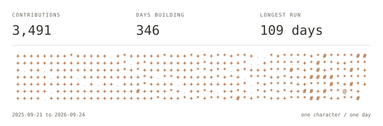
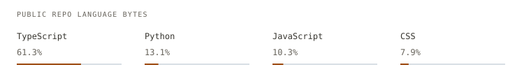

<!-- Generated from data/profile.json by npm run generate. See docs/DEVELOPMENT.md. -->

<a href="https://matthewkim323.github.io/MatthewKim323/" aria-label="Visit matt's moonlit ocean">
<picture>
  <source media="(prefers-color-scheme: dark)" srcset="./assets/ocean-dark.svg">
  
</picture>
</a>

# matt kim

<samp>building things people would actually use.</samp>

[portfolio](https://mykm.dev) &nbsp; / &nbsp; [github](https://github.com/MatthewKim323) &nbsp; / &nbsp; [linkedin](https://www.linkedin.com/in/matthew-y-kim) &nbsp; / &nbsp; [x](https://x.com/matthewykim23) &nbsp; / &nbsp; [devpost](https://devpost.com/matthewykim23) &nbsp; / &nbsp; [resume](https://mykm.dev/matthew-resume.pdf) &nbsp; / &nbsp; [email](mailto:matthewykim23@gmail.com)

<picture>
  <source media="(prefers-color-scheme: dark)" srcset="./assets/heading-about-dark.svg">
  
</picture>

> full\-stack and agentic engineer\. 
> 13 hackathon wins in 6 months.

i started with a python text adventure in middle school\. that curiosity grew into state\-level robotics, hackathons, and a habit of learning whatever a problem needs to get it shipped\.

san francisco / ucsb, studying stats &amp; data science and economics\. i like turning frontier models into products that are fast, reliable, and actually useful\.

<samp>persistent context &nbsp; / &nbsp; embodied agents &nbsp; / &nbsp; real-time voice &nbsp; / &nbsp; computer use</samp>

<picture>
  <source media="(prefers-color-scheme: dark)" srcset="./assets/heading-work-dark.svg">
  
</picture>

**[agartha](https://mykm.dev/work/agartha)** · insforge winner @ agi summit 2026 
a minecraft companion that talks and acts at the same time, with memory shared across sessions through jabby\. 
typescript · gemini live · mineflayer · gbrain

**[jabby](https://mykm.dev/work/jabby)** 
my discord\-native, always\-on agent\. background jobs, live voice calls, persistent memory, and a minecraft body\. 
typescript · discord · claude code · gbrain

**[angel](https://mykm.dev/work/angel)** · best overall @ nozomio ai agents hackathon 
a kawaii ai coworker with persistent memory, a 3d desk, and agents that work alongside you\. 
react · three.js · convex · codex

**[iris](https://mykm.dev/work/iris)** · 2nd place overall @ citrushacks 
select a region, describe an edit, and carry that change across a video while preserving continuity\. 
react · fastapi · sam · ffmpeg

**[nami](https://mykm.dev/work/nami)** · 1st @ fullyhacks 
a pixel\-art counseling office for first\-gen students, with knowledge\-graph answers grounded in their own source files\. 
next.js · supabase · pixijs · claude

**[ione](https://mykm.dev/work/ione)** · 1x winner @ broncohacks 
an ai math tutor in the margin: screen\-aware ocr, reasoning, and voice grounded in the learner's files\. 
react · hono · supabase · elevenlabs

**[kali v0](https://mykm.dev/work/kali-v0)** · 1x winner @ hackdavis 
one chat across 11\+ nonprofit tools: donors, grants, finance, programs, and comms, with source\-record citations\. 
next.js · claude · supabase · drizzle

**[flow](https://mykm.dev/work/flow)** · 2x winner @ sbhacks 
speak a concept, step inside a gaussian\-splat world, and explore it with an ai narrator\. 
react · three.js · world labs · elevenlabs

**[dialed](https://mykm.dev/work/dialed)** · 2x winner @ beachhacks 
agents that watch social feeds, identify manipulation patterns, and coordinate real\-time interventions\. 
react · fastapi · fetch.ai uagents · browser use

**[bro](https://mykm.dev/work/bro)** · 3x winner @ designverse 
a personal ai agent with a visible memory graph, live market context, and a paper\-trading desk with action traces\. 
react · mongodb atlas · backboard · solana

<strong>more things i've built</strong>

 

**[itto](https://mykm.dev/work/itto)** 
a minecraft co\-op buddy that follows, mines, fights, crafts, and talks in discord, with fast reflexes and a slower reasoning loop\. 
mineflayer · mcp · sqlite · discord

**[gopal](https://mykm.dev/work/gopal)** 
a real\-time voice and vision companion for browser cameras and apple vision pro, embodied as a 3d character\. 
three.js · openai realtime · webrtc · bun

**[cadence](https://mykm.dev/work/cadence)** 
a multi\-agent writing studio that learns your voice, drafts in your style, and iterates with detector feedback\. 
react · fastapi · fetch.ai · claude

**[tapn](https://mykm.dev/work/tapn)** 
six agents for job discovery, tailored resumes, applications, scheduling, and voice interview practice\. 
react · supabase · openclaw · elevenlabs

**[syla](https://github.com/MatthewKim323/syla_export)** 
the academic context layer for ai\. sync canvas into a classroom brain that chatgpt can query through mcp\. 
typescript · next.js · postgres · mcp

**[editskill](https://github.com/MatthewKim323/editskill)** 
agent prompts to demo videos\. capture a website, edit a recordly project, and render an mp4 in headless chromium\. 
python · node.js · chromium · recordly

**[1to1](https://github.com/MatthewKim323/1to1)** 
measure a live website, rebuild its layout and motion, then verify the result with pixel diffs across breakpoints\. 
typescript · bun · chromium

**[nerve](https://github.com/MatthewKim323/agarstra)** 
a little intent, a lot more possible\. local\-first computer use with single\-switch input, experimental gaze, and explicit action approval\. 
typescript · react · onnx · mediapipe

**[ace](https://github.com/MatthewKim323/aceds)** 
a ucsb schedule builder: xgboost over 104k course rows and 17 years of grades, plus a 44ms median integer\-program scheduler\. 
python · xgboost · pulp · fastapi

<picture>
  <source media="(prefers-color-scheme: dark)" srcset="./assets/heading-activity-dark.svg">
  
</picture>

<picture>
  <source media="(prefers-color-scheme: dark)" srcset="./assets/activity-dark.svg">
  
</picture>

<picture>
  <source media="(prefers-color-scheme: dark)" srcset="./assets/languages-dark.svg">
  
</picture>

GitHub-reported activity · public repository language bytes · refreshed 2026-09-25
