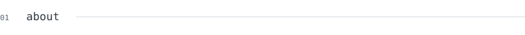
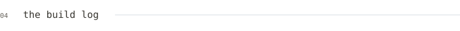

<!-- Generated from data/profile.json by npm run generate. See docs/DEVELOPMENT.md. -->

<a href="https://matthewkim323.github.io/MatthewKim323/" aria-label="Meet matt's interactive ASCII bot">
<picture>
  <source media="(prefers-color-scheme: dark)" srcset="./assets/bot-dark.svg">
  
</picture>
</a>

# matt kim

<samp>for the love of the game.</samp>

[github](https://github.com/MatthewKim323) &nbsp; / &nbsp; [email](mailto:founders@kalilabs.ai) &nbsp; / &nbsp; [meet the bot ↗](https://matthewkim323.github.io/MatthewKim323/)

<picture>
  <source media="(prefers-color-scheme: dark)" srcset="./assets/heading-1-dark.svg">
  
</picture>

> i build agents, context systems, and the tools to ship them\. 
> 13x hackathon winner.

builder working across ai agents, infrastructure, and interfaces with a little personality\.

persistent context\. useful autonomy\. software that feels alive\.

<samp>ai agents &nbsp; / &nbsp; context &amp; memory &nbsp; / &nbsp; creative tools &nbsp; / &nbsp; infrastructure</samp>

<picture>
  <source media="(prefers-color-scheme: dark)" srcset="./assets/heading-2-dark.svg">
  
</picture>

**[syla](https://github.com/MatthewKim323/syla_export)** 
the academic context layer for ai\. sync canvas into a classroom brain that chatgpt can query through mcp\. 
typescript · next.js · postgres · mcp

**[editskill](https://github.com/MatthewKim323/editskill)** 
agent prompts to demo videos\. capture a website, edit a recordly project, and render an mp4 in headless chromium\. 
python · node.js · chromium · recordly

**[1to1](https://github.com/MatthewKim323/1to1)** 
measure a live website, rebuild its layout and motion, then verify the result with pixel diffs across breakpoints\. 
typescript · bun · chromium

**[nerve](https://github.com/MatthewKim323/agarstra)** 
a little intent, a lot more possible\. local\-first computer use with single\-switch input, experimental gaze, and explicit action approval\. 
typescript · react · onnx · mediapipe

**[flow](https://github.com/stephenhungg/flow)** · 2x winner @ sbhacks 
speak a concept, step inside a gaussian\-splat world, and explore it with an ai narrator\. 
react · three.js · world labs · elevenlabs

**[nami](https://github.com/MatthewKim323/nami)** · 1st place @ fullyhacks 
a pixel\-art counseling crew for first\-gen students\. knowledge\-graph answers linked to the student's own source files\. 
next.js · drizzle · supabase

<strong>more things i've built</strong>

 

**jabby** 
my discord\-native, always\-on claude code agent\. lives in the background and keeps the work moving\. 
claude code · discord

**[kali v0](https://github.com/stephenhungg/kali-v0)** · winner @ uc davis 
one chat across 11\+ nonprofit tools: donors, grants, finance, programs, and comms, with source\-record citations\. 
next.js · typescript · supabase · claude

**[dialed](https://github.com/MatthewKim323/dialed)** · 2x winner @ csulb 
agents that classify manipulation in social feeds, from rage bait to fomo hooks, and coordinate interventions\. 
react · fastapi · fetch.ai · browser-use

**[bro](https://github.com/MatthewKim323/bro)** · 3x winner @ ucr 
personal\-agent experiments around knowledge\-graph memory and paper trading\. public repo: the landing foundation\. 
next.js · react · tailwind

**[ione](https://github.com/MatthewKim323/ione)** · winner @ cpp 
an ai math tutor in the margin\. screen\-aware ocr, reasoning, and voice grounded in the learner's own files\. 
react · hono · supabase · elevenlabs

**[iris](https://github.com/stephenhungg/iris)** · 2nd place 
prompt\-driven video editing for localized reality changes and continuity across frames\. 
react · fastapi · sam · clip

**[angel](https://github.com/stephenhungg/angel)** · nozomio hackathon winner 
a kawaii desktop coworker with an embodied room, persistent memory, and an agent loop that ships code\. 
electron · react three fiber · convex · nia

**[ace](https://github.com/MatthewKim323/aceds)** 
a ucsb schedule builder: xgboost over 104k course rows and 17 years of grades, plus a 44ms median integer\-program scheduler\. 
python · xgboost · pulp · fastapi

**[cadence](https://github.com/MatthewKim323/cadence)** 
a multi\-agent writing studio that learns your voice, drafts in your style, and iterates with detector feedback\. 
react · fastapi · fetch.ai · claude

**[tapn](https://github.com/MatthewKim323/tapn)** 
six agents for job discovery, tailored resumes, applications, scheduling, and voice interview practice\. 
react · supabase · openclaw · elevenlabs

<picture>
  <source media="(prefers-color-scheme: dark)" srcset="./assets/heading-3-dark.svg">
  
</picture>

**[prodcheck](https://github.com/MatthewKim323/prodcheck)** 
production readiness audits across eight dimensions, with line\-level findings and concrete fixes\. 
claude code skill

**[seccheck](https://github.com/MatthewKim323/seccheck)** 
security reviews across ten domains, including prompt injection, agent authorization, and model spend limits\. 
claude code skill

**[prwrite](https://github.com/MatthewKim323/prwrite)** 
pull request descriptions grounded in the diff, issue references, risk, and the repository's template\. 
claude code skill

**[testwrite](https://github.com/MatthewKim323/testwrite)** 
test generation across happy paths, boundaries, failures, abuse, idempotency, and regressions\. 
claude code skill

**[contextcheck](https://github.com/MatthewKim323/contextcheck)** 
check code against a company's stack, engineering patterns, and compliance expectations\. 
claude code skill

**[research](https://github.com/MatthewKim323/research)** 
company research that can feed a persistent gbrain knowledge base\. 
claude code skill · gbrain

<picture>
  <source media="(prefers-color-scheme: dark)" srcset="./assets/heading-4-dark.svg">
  
</picture>

<picture>
  <source media="(prefers-color-scheme: dark)" srcset="./assets/activity-dark.svg">
  
</picture>

<picture>
  <source media="(prefers-color-scheme: dark)" srcset="./assets/languages-dark.svg">
  
</picture>

GitHub-reported activity · public repository language bytes · refreshed 2026-09-16

<picture>
  <source media="(prefers-color-scheme: dark)" srcset="./assets/heading-5-dark.svg">
  
</picture>

The character is drawn from 3D geometry into a grid of ASCII characters. On GitHub, it runs a quiet idle loop. On the [live page](https://matthewkim323.github.io/MatthewKim323/), its eyes and head follow your cursor.

One character engine powers both. The graphics, font, and activity snapshot live in this repo. Light and dark themes, reduced motion, and a static fallback are built in. [How it works](./docs/DEVELOPMENT.md) · [character engine](./src/bot-core.mjs).

built with care. kept in motion.

